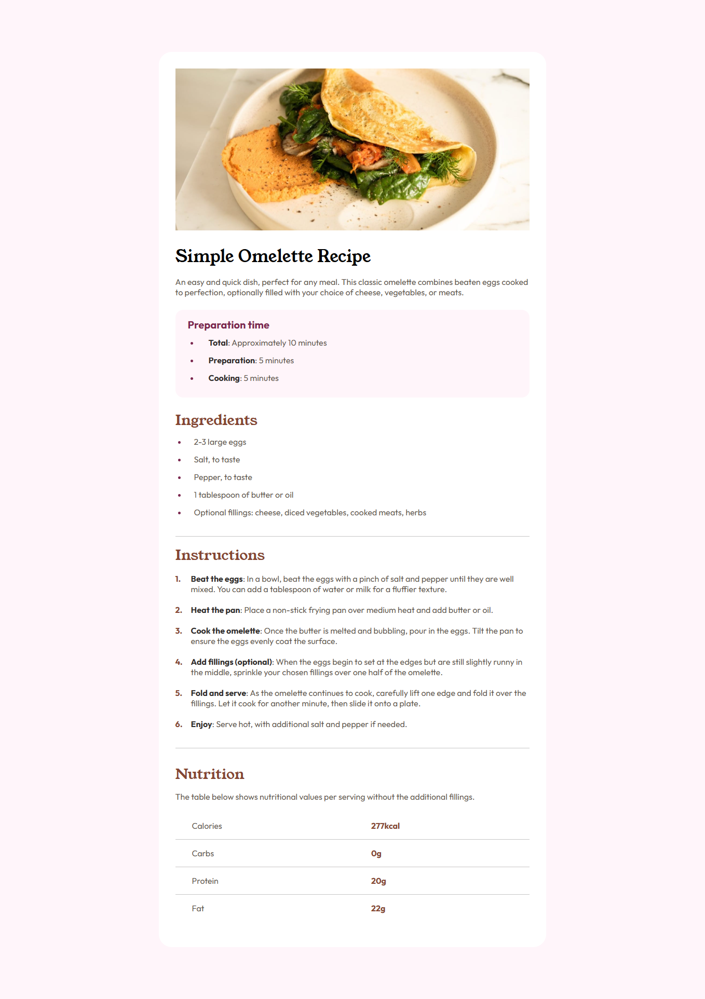
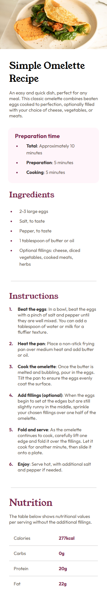

# Frontend Mentor - Recipe page solution

This is a solution to the [Recipe page challenge on Frontend Mentor](https://www.frontendmentor.io/challenges/recipe-page-KiTsR8QQKm). Frontend Mentor challenges help you improve your coding skills by building realistic projects. 

## Table of contents

- [Overview](#overview)
  - [The challenge](#the-challenge)
  - [Screenshot](#screenshot)
  - [Links](#links)
  - [Built with](#built-with)
  - [What I learned](#what-i-learned)
  - [Continued development](#continued-development)
- [Author](#author)
- [Acknowledgments](#acknowledgments)

## Overview

### The Challenge
The challenge is to build out this recipe page and get it looking as close to the design as possible.

### Screenshot

### Links

- Solution URL: [GitHub Repo](https://github.com/Chantal-Yvonne/recipe-page)
- Live Site URL: [Add live site URL here]( https://chantal-yvonne.github.io/blog-preview-card/)

### Built with

- Semantic HTML5 markup
- CSS custom properties
- Mobile-first workflow

### What I learned
With this challenge I have learnt how to start with small screens to create  simple layout and to add complexity at larger breakpoints.I have also learned how to use counter-reset,counter-increment, and counter(name) to create custom numbering. 

### Continued development

I will continue to practice the mobile first approach and enhance layout complexity only when needed

## Author

- Frontend Mentor - [@Chantal-Yvonne](https://www.frontendmentor.io/profile/Chantal-Yvonne)

## Acknowledgments

This project was built based on a design brief provided by [Frontend Mentor](https://www.frontendmentor.io/).
Thanks to the Frontend Mentor community for creating helpful challenges that support practical learning and real-world development skills